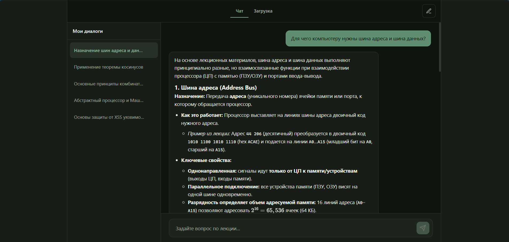
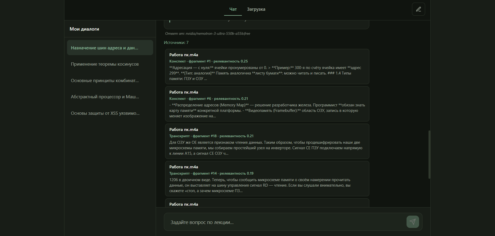
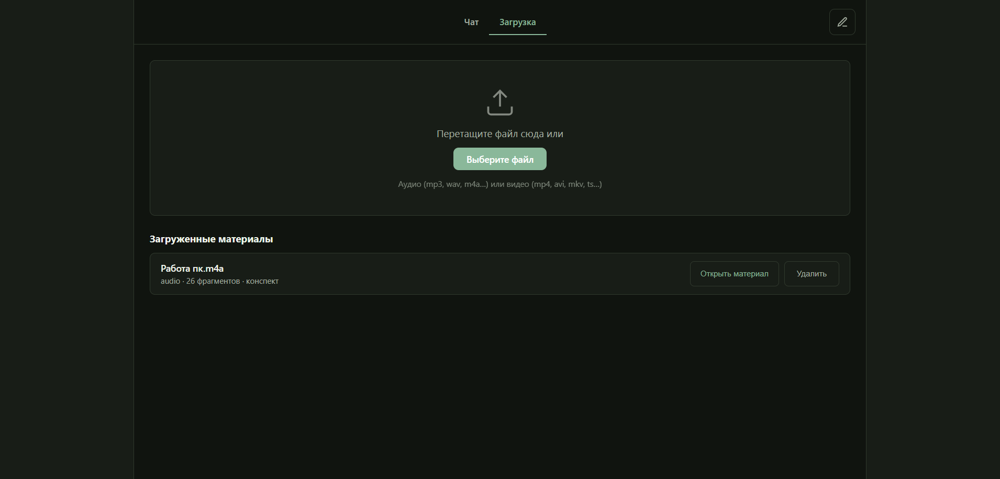
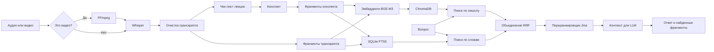

# Lection Helper

Lection Helper превращает запись лекции в базу знаний: находит нужный момент и отвечает на вопросы по материалу.

Пользователь загружает аудио или видео. Система распознаёт речь, собирает конспект, индексирует материал и отвечает на вопросы по этой лекции. Вместе с ответом она показывает найденные фрагменты.

> Статус: локальный рабочий прототип для одного пользователя. Авторизация и многопользовательский режим пока не реализованы.

## Что делает система

- принимает аудио и видео, из видео извлекает звук через FFmpeg
- распознаёт речь локально моделью Whisper, дообученной на русском (модель `bond005/whisper-podlodka-turbo`)
- сначала строит чек-лист тем и заданий лекции, потом по нему собирает конспект
- обрабатывает длинные лекции по частям с учётом ограничения контекста модели
- индексирует и конспект, и полный транскрипт
- при вопросе ищет ответ двумя способами сразу, по смыслу и по точным словам, и объединяет результаты
- повторно оценивает порядок найденных фрагментов с помощью Jina reranker
- сохраняет чаты, историю, модель ответа и показанные источники в SQLite
- показывает под ответом фрагменты лекции, которые получила модель.

## Интерфейс

Ответ по материалам загруженной лекции:



Под ответом видны использованные фрагменты — из конспекта и транскрипта, с релевантностью:



Загрузка лекции и список обработанных материалов:



## Как это работает



### Обработка лекции

1. FastAPI принимает файл и запускает фоновую обработку с прогрессом.
2. Из видео FFmpeg извлекает аудио 16 кГц.
3. Whisper распознаёт речь.
4. При наличии словаря замен система исправляет повторяющиеся ошибки распознавания.
5. LLM строит чек-лист тем и заданий, а затем конспект. Добавлен чек-лист после того, как прямое конспектирование длинной лекции пропустило часть заданий. Конспект сохраняется как отдельное структурированное представление материала и индексируется вместе с транскриптом.
6. Конспект и транскрипт разбиваются на фрагменты.
7. BGE-M3 строит эмбеддинги для ChromaDB.
8. Те же фрагменты сохраняются в SQLite FTS5 для точного поиска по словам.
9. Транскрипт, конспект и метаданные сохраняются в SQLite.

### Ответ на вопрос

1. BGE-M3 строит эмбеддинг вопроса.
2. Система формирует четыре списка кандидатов: смысловой и лексический поиск отдельно по конспекту и транскрипту.
3. Списки объединяются через Reciprocal Rank Fusion. У двух способов поиска разные шкалы оценок, поэтому RRF учитывает позиции фрагментов в списках.
4. Jina переранжирует кандидатов раздельно для конспекта и транскрипта, чтобы короткий конспект не вытеснил детальные фрагменты речи.
5. Лучшие фрагменты вместе с историей чата уходят в LLM.
6. Интерфейс показывает ответ и список фрагментов, переданных модели.

Показанные фрагменты были переданы LLM как контекст и позволяют сверить ответ с лекцией. Список не показывает, какие фрагменты повлияли на генерацию.

## Технологии

| Задача | Реализация |
|---|---|
| Backend и API | FastAPI |
| Распознавание речи | Whisper (`bond005/whisper-podlodka-turbo`) |
| Эмбеддинги | `BAAI/bge-m3` |
| Поиск по смыслу | ChromaDB |
| Поиск по словам | SQLite FTS5 |
| Объединение результатов | Reciprocal Rank Fusion |
| Переранжирование | `jinaai/jina-reranker-v3` |
| Генерация ответа | LLM через OpenRouter |
| История чатов | SQLite |
| Интерфейс | HTML, CSS, JavaScript |

## Авторская реализация

Я использовал готовые модели и не обучал их с нуля. Я реализовал:

- архитектура и полный поток данных от загрузки файла до ответа
- обработка длинных лекций и этап чек-листа перед конспектом
- раздельная индексация конспекта и транскрипта
- объединение смыслового и лексического поиска через RRF
- раздельное переранжирование фрагментов
- FastAPI backend, интерфейс, чаты и сохранение истории.

## Быстрый запуск

Нужно: Python 3.11 или 3.12, FFmpeg в `PATH`, ключ OpenRouter, место на диске под модели. GPU не обязателен, но ускоряет обработку. При первом запуске модели скачиваются автоматически.


### Установка проекта

```bash
git clone https://github.com/adasdada1/Lection-Helper.git
cd Lection-Helper

python -m venv .venv
source .venv/Scripts/activate   # Windows Git Bash

python -m pip install --upgrade pip
python -m pip install -r requirements.txt
cp .env.example .env
```

Ключ в `.env`:

```env
OPENROUTER_API_KEY=your_openrouter_key_here
RERANKER_BATCH_SIZE=4
```

Запуск:

```bash
uvicorn main:app --reload
```

Открыть `http://127.0.0.1:8000`. Проверка backend: `curl http://127.0.0.1:8000/api/health` вернёт `{"status":"ok"}`.

## Что уходит наружу

Локально выполняются распознавание речи, эмбеддинги, оба поиска, переранжирование и хранение данных.

В OpenRouter передаются:

- транскрипт или его части при создании конспекта
- найденные фрагменты и вопрос при генерации ответа
- части истории при сжатии диалога.


## Ограничения

- на вход только аудио и видео, без PDF, слайдов и распознавания текста с изображений (планируется в дальнейшем добавить это)
- генерация ответа зависит от внешнего OpenRouter: локальные части работают без сети, но без LLM-провайдера ответ не построить
- нет авторизации и разделения данных между пользователями


## Структура проекта

```text
core/            компоненты обработки и поиска
prompts/         промпты для чек-листа и конспекта
static/          веб-интерфейс
screenshots/     скриншоты интерфейса для README
main.py          маршруты FastAPI
requirements.txt зависимости
.env.example     шаблон настроек
bad_words.json   словарь замен для транскрипта
data/, uploads/  локальные данные, в репозиторий не попадают
```
