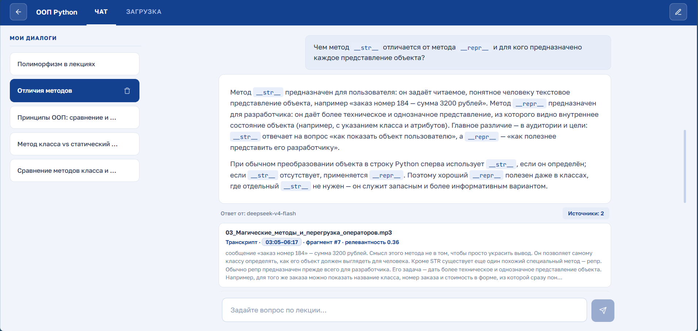
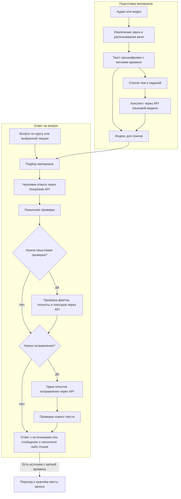

# Lection Helper

Lection Helper помогает разбирать записанные лекции и готовиться к занятиям. Пользователь загружает аудио или видео, получает конспект и задаёт вопросы по материалам курса или отдельной лекции.

Если нужно вспомнить объяснение преподавателя, не приходится искать его по всей записи вручную. Система находит подходящие фрагменты, формирует ответ и показывает источники. По метке времени можно открыть аудио или видео на нужном моменте и послушать объяснение в исходном контексте.

> Статус: локальный рабочий прототип для одного пользователя. Авторизация и многопользовательский режим пока не реализованы.

## Что делает система

- Преобразует речь из аудио и видео в текст.
- Составляет конспект по предварительному списку тем и заданий. Длинные лекции обрабатывает по частям.
- Ищет объяснения по материалам курса;
- Отвечает на вопросы своими словами с опорой на материал, проверяет спорные утверждения и полноту составных ответов.
- Показывает текст источников и позволяет перейти к соответствующему месту записи, если для фрагмента есть метка времени и сохранён исходный файл.
- Сохраняет чаты, историю вопросов и источники, чтобы к разбору можно было вернуться.

## Интерфейс

Ответ по материалам загруженной лекции:


Источники под ответом: фрагменты лекции и метки времени для перехода к записи.



Загрузка лекции и список обработанных материалов:


### Видеодемонстрация

[Смотреть демонстрацию ответа](video/answer-demonstration.mp4)

## Обработка лекции и подготовка ответа



### Обработка лекции

1. FastAPI принимает файл и запускает фоновую обработку с прогрессом.
2. Из видео FFmpeg извлекает аудио 16 кГц.
3. Whisper распознаёт речь и формирует текст расшифровки, или транскрипт.
4. При наличии словаря замен система исправляет повторяющиеся ошибки распознавания.
5. Через API языковой модели система составляет список тем и заданий, а затем конспект. Предварительный список помогает удержать структуру длинной лекции и не потерять задания при сокращении текста.
6. Конспект и транскрипт разбиваются на фрагменты.
7. BGE-M3 строит эмбеддинги для ChromaDB.
8. Те же фрагменты сохраняются в SQLite FTS5 для точного поиска по словам.
9. Транскрипт, конспект и метаданные сохраняются в SQLite.

### Ответ на вопрос

1. Система определяет, где искать: в материалах курса или только в выбранной лекции.
2. В обычном режиме поиск идёт по смыслу и по точным словам, отдельно по конспекту и транскрипту. Результаты объединяются через Reciprocal Rank Fusion, затем Jina reranker уточняет их порядок. Раздельная обработка нужна, чтобы краткий конспект не вытеснил подробное объяснение преподавателя.
3. Если выбранная лекция короткая и укладывается в лимиты контекста, система передаёт весь её транскрипт без предварительного отбора. Когда локальные модели заняты, доступен резервный поиск по словам.
4. В DeepSeek API отправляются вопрос, материал и контекст диалога. Модель готовит ответ и связывает его части с фрагментами транскрипта. Конспект помогает восстановить термины и понять тему; при расхождении приоритет у транскрипта.
5. После локальной проверки спорные утверждения и составные вопросы проходят дополнительную проверку через API. Она оценивает соответствие материалу, раскрытие запрошенных частей и повторы. Простой ответ без выявленных рисков может обойтись без этого вызова.
6. При обнаружении пропуска или ошибки предусмотрена одна попытка исправления. Новый текст проверяется перед заменой принятой части. Если полного подтверждённого ответа собрать не удалось, система сообщает о неполноте или о том, что ответ не прошёл проверку.
7. Интерфейс показывает итоговый ответ и связанные с ним источники.

### Источники и переход к записи

Для подготовки ответа используются конспект и транскрипт. Под итоговым ответом в основном смысловом режиме выводится не весь найденный материал, а фрагменты транскрипта, связанные с принятыми частями объяснения. После проверки набор источников может измениться.

Карточка источника содержит название лекции, текст фрагмента и, при наличии, метку времени. Нажатие на метку открывает запись с начала соответствующего фрагмента. Это позволяет переслушать преподавателя и проверить ответ самостоятельно.

Оценка релевантности показывает соответствие найденного фрагмента запросу, а не вероятность правильности ответа. Ссылки на материал и автоматическая проверка тоже не исключают ошибок модели или распознавания речи.

## Технологии

| Задача | Реализация |
|---|---|
| Backend и API | FastAPI |
| Распознавание речи | Whisper (`bond005/whisper-podlodka-turbo`) |
| Эмбеддинги | `BAAI/bge-m3` |
| Поиск по смыслу | ChromaDB |
| Поиск по словам | SQLite FTS5 |
| Объединение результатов | Reciprocal Rank Fusion |
| Переранжирование | `jinaai/jina-reranker-v3` |
| Ответы и смысловая проверка | DeepSeek API (`deepseek-v4-flash`) |
| Конспект и служебные тексты | DeepSeek API без thinking |
| История чатов | SQLite |
| Интерфейс | HTML, CSS, JavaScript |

## Авторская реализация

Я использовал готовые модели и не обучал их с нуля. Я реализовал:

- архитектуру и полный поток данных от загрузки файла до ответа
- обработку длинных лекций и этап чек-листа перед конспектом
- раздельную индексацию конспекта и транскрипта
- объединение смыслового и лексического поиска через RRF
- раздельное переранжирование фрагментов
- FastAPI backend, интерфейс, чаты и сохранение истории.

## Быстрый запуск

Нужны Python 3.11 или 3.12, FFmpeg в `PATH`, доступ к API и место на диске для локальных моделей. GPU не обязателен, но ускоряет обработку. При первом запуске модели скачиваются автоматически. Приложение работает локально, но генерация текста требует подключения к внешним API.


### Установка проекта

```bash
git clone https://github.com/adasdada1/Lection-Helper.git
cd Lection-Helper

python -m venv .venv
source .venv/Scripts/activate   # Windows Git Bash

python -m pip install --upgrade pip
python -m pip install -r requirements.txt
cp .env.example .env
```

Настройки DeepSeek в `.env`:

```env
DEEPSEEK_API_KEY=your_direct_deepseek_key_here
DEEPSEEK_MODEL=deepseek-v4-flash
GROUNDING_MODE=semantic
```

Все запросы к языковой модели идут через DeepSeek; переход на OpenRouter возможен после адаптации API-клиента.

Остальные параметры можно оставить из `.env.example`. Ключи не следует публиковать или добавлять в Git.

Запуск:

```bash
uvicorn main:app --reload
```

Открыть `http://127.0.0.1:8000`. Проверка backend: `curl http://127.0.0.1:8000/api/health` вернёт `{"status":"ok"}`.

## Информация про данные

Распознавание речи, построение поискового индекса, поиск, переранжирование и хранение данных выполняются локально. Исходные аудио- и видеофайлы для генерации текста не отправляются: внешние API получают текстовые данные.

Состав запроса зависит от задачи:

- При подготовке конспекта отправляются транскрипт или его части, список тем и промежуточные текстовые результаты.
- При ответе на вопрос отправляются сам вопрос, подобранный материал, релевантные конспекты и контекст диалога.
- При проверке и исправлении отправляются текст ответа, источники, требования к полноте и замечания предыдущей проверки.
- Для заголовка чата и сжатия истории отправляются соответствующие сообщения или их текстовая сводка.

Локальный запуск не делает обработку полностью закрытой: текст лекций и переписки передаётся провайдерам API. Перед загрузкой материалов с персональными или конфиденциальными данными нужно учитывать условия выбранных сервисов.

### Другие API и локальные модели

Архитектуру можно адаптировать для другого API, например GigaChat или YandexGPT, либо для языковой модели, запущенной на своём компьютере или сервере. Распознавание и поиск при этом могут остаться прежними.

Это направление развития. Потребуется адаптировать клиент API, авторизацию, формат структурированных ответов и ограничения контекста, затем проверить качество конспектов и ответов. Для полностью локальной обработки нужно заменить все внешние вызовы, включая конспекты и служебные задачи. Требования к памяти и вычислительным ресурсам будут зависеть от выбранной модели.


## Ограничения

- на вход только аудио и видео, без PDF, слайдов и распознавания текста с изображений (планируется в дальнейшем добавить это)
- конспекты, ответы и служебные тексты зависят от доступности внешних API и их тарифов
- нет авторизации и разделения данных между пользователями
- ошибки распознавания, неполный поиск и ошибки языковой модели могут повлиять на ответ; последние изменения смысловой проверки требуют отдельной проверки на реальных вопросах
В дальнейшем это все планируется реализовать.


## Структура проекта

```text
core/            обработка лекций, поиск, API-клиенты, проверка ответов и история чатов
prompts/         инструкции моделям: конспекты, ответы, проверка и исправление
static/          веб-интерфейс с чатом, загрузкой и проигрывателем записей
tests/           тесты компонентов и сценариев ответа
screenshots/     скриншоты интерфейса для README
main.py          маршруты FastAPI
requirements.txt зависимости
.env.example     шаблон настроек
bad_words.json   словарь замен для транскрипта
data/, uploads/  локальные данные, в репозиторий не попадают
```

Для разбора ответов используется `data/semantic_diagnostics.jsonl` с ротацией. В нём сохраняются вопрос, исходный ответ модели, контекст проверки и вердикты. Этот журнал содержит учебные тексты и переписку; публиковать его вместе с проектом не следует.
